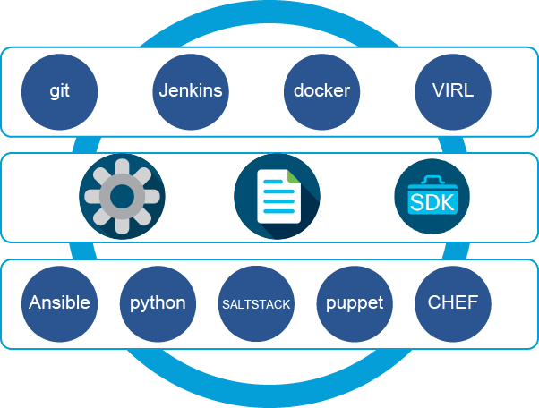
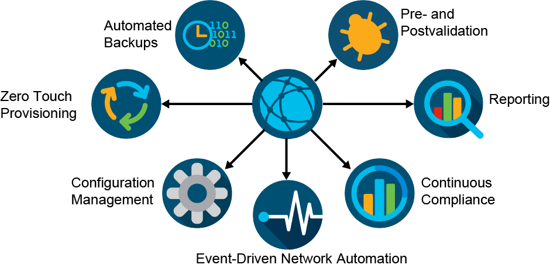
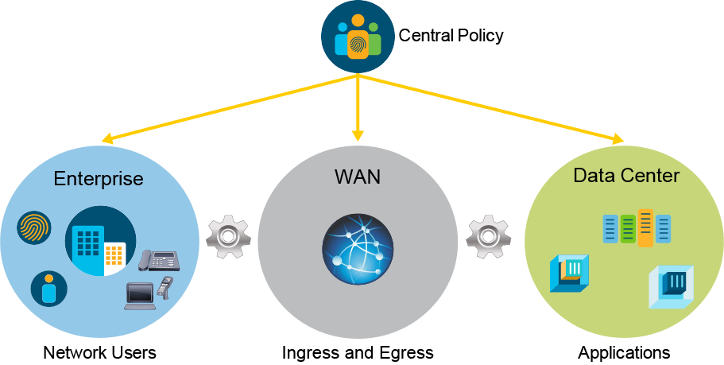
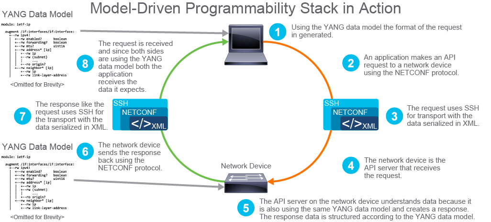

## Traditional Network Management
 Network operations, as you know them, are based on human interaction with network devices. Commonly using text editors, network engineers build one device configuration at a time. Engineers may copy an existing configuration into a file and search their way through updating it for each new device. Once this archaic method of building configurations is complete, network engineers connect to devices using either the console, Telnet, or SSH, to copy and paste the configurations onto the devices. 

 

 This process poses several problems when working with networks of any shape and size. As you look back at how networks have been managed, consider the following:

- First, the CLI was designed for human interaction and limits the speed of configuration to the speed at which the user can work. 

- Second, manual configuration and common copying and pasting methods are extremely prone to error, especially when configuring multiple devices. 

- Third, tasks are not easily repeatable and result in suboptimal workflows. 

In the late 1980s, the industry developed an interface that was built for machine-to-machine communications to manage and monitor large networks in a standardized fashion. It was called the **Simple Network Management Protocol (SNMP)**. Instead of an engineer connecting to each device and obtaining necessary information, a server, part of a network management system (NMS), performed this function through SNMP polling. The interface had another benefit: if something went wrong or an event occurred, the device notified the server using SNMP traps. Although SNMP can also configure devices to a certain degree, it is rarely used in that manner in production. SNMP has its issues as well, but it was a move in the right direction. 

Although SNMP has different properties, it is best known and used today to simply poll network devices for operational statuses such as interface up, interface down, memory utilization, CPU utilization, bandwidth utilization, and many other basic properties.

---

# Scaling Network Management

With the CLI and SNMP as the dominant methods of network management, here is an example of how teams typically would scale: What do they do and how do they operate as the network continues to evolve? Even if networks are not expanding based on the number of routers and switches, in the past several years, additional devices and services have been increasing the size and complexity of the network: security, wireless, network fabric controllers, network overlays, and IPv6, to list just a few.  

Imagine a company that has a small network with only a few network engineers. They can easily manage all nodes by just using CLI access. Over the course of a few years, the company has some growth and experiences more challenges in network operations. Now the network has more devices, which require more staff to support them. As the network scales, the major response historically has been to hire more network engineers. 

Although using the CLI should not be justifiable anymore, it has been the customary approach in the industry. However, there is a benefit of hiring more engineers—it creates skill-set diversity, which further highlights the issue. One new engineer might learn Python and another one learns Ansible. Although both of these tools help manage many devices at the same time, they also offer the ability to standardize and reduce human error. Each of these engineers improved their performance individually.

As time continues to go by, the network continues to expand and configurations are gradually added, which makes manual configuration management more difficult. Although it is more difficult to manage manually, each team member continues to do what they think is right for network automation. Some engineers use their own databases, some use Bash scripts, some use Perl scripts, some execute scripts from a server and store them in a git repository.

Although this is common, it does not benefit the network engineers and business. These tools are more than capable of managing the network, but there is no overall automation strategy. This mode of operation shows the value of automation and allows for some learned skills, but it should only be executed as a proof of concept (POC). Automating in production requires proper controls as part of a cohesive network management strategy.

---

# Practice Quiz for Traditional Network Management

**Question 1**: Which two statements best describe the current state of network operations? (Choose two.)

SSH and CLI are the primary means of network management.   

**Correct**
Most network operation teams still configure and manage their devices manually through the CLI, which can be accessed through a Console connection or over a network connection via SSH. 

SNMP is the primary programmatic interface for network management systems to communicate with network devices

**Correct**
Although many new network devices now offer APIs for network management, there are still many more legacy network devices in service that only support SNMP read and write access 

**Question 2**: What does a network operation team require in order to successfully benefit from network automation?

Network Operations teams need a cohesive network management strategy with proper controls and standards.

**Correct**
For network operations teams to be successful with network automation, they need a cohesive network management strategy. Without any direction or controls on how network automation will be handled can lead to technical gaps, miscommunications, and other adverse impacts that will make the network more difficult to handle.

**Question 3**: What is one reason why Simple Network Management Protocol (SNMP) is not an optimal protocol for programmatic network device configuration?

SNMP is not as reliable as other network configuration protocols.

**Correct**
SNMP has limited functionality compared to other more robust protocols used for network automation, such as NETCONF and RESTCONF. SNMP also has much more overhead compared to newer protocols, which can cause performance issues on network devices. SNMP can be more complex to understand and use, potentially leading to more errors when used in network automation.  These are some reasons that make SNMP a less reliable protocol for network automation compared to others.

---

# Network Automation and Programmability

There is currently a major industry shift away from the CLI as the primary way to interface with a network device. Network automation is taking shape with the rise of application programming interfaces (API)s that exist on network devices and software-defined network (SDN) controllers. Although the motto is “the API is the new CLI,” the truth is that the use of GUIs is diminishing too with the rise of APIs and automation.

There are several important APIs and technologies that are used to create robust programmatic interfaces to network devices:

- Representational State Transfer (REST) APIs

- Network Configuration Protocol (NETCONF)

- REST Configuration Protocol (RESTCONF)

- "Yet Another Next Generation" (YANG) models (not an API, but a modeling language to create models that are used by the APIs)

- gRPC remote procedure call

The networking devices are the last pieces of the puzzle. They need to support one or more of the methods that were mentioned earlier to be easily adopted. Cisco is already on a mission to make every device API-enabled in every product family. You will find APIs on Cisco devices and on controller platforms like Cisco Application Policy Infrastructure Controller (APIC), Cisco DNA Center, and many more.

It is also worth mentioning that CLI is not going away anytime soon. It is a verified way to interact with network devices, and when advanced troubleshooting is required, it will be performed using CLI via SSH. When needed, network automation systems can also use SSH to communicate with network devices, especially when the device is older, or when the tool itself has not been updated to use a device’s API.

---

# Beyond APIs

The connection methods that need to be in place for machine-to-machine communication to happen, such as programmatic APIs on network devices, were discussed earlier. However, it is absolutely critical to understand that APIs are simply enablers. Although they are the foundation of next-generation automation, it is important to have a holistic view of operations and how those device APIs can be used within the life cycle of the network itsel       

There are a few key trends that are emerging within the network industry, including development and operations (DevOps), Open Source, and the rise of automatable test infrastructure. 

- **DevOps**: DevOps is a cultural trend to promote and develop methods that improve speed and agility in the deployment, maintenance, and continual improvement of systems and infrastructure. It is important to understand that this cultural trend is driving better configuration and automation tools for network engineers. From within the DevOps movement, networking professionals can learn how applications, developers, and systems peers have been using DevOps tools including Git, Jenkins, Docker, Ansible, Salt, Puppet, and Chef, to name just a few.  

- **Open Source**: Within the DevOps movement, many of the tools are open source, but the companies that support the open-source projects offer commercial versions or support for the software. For example, although Git is open source, there are commercial offerings like GitHub, BitBucket, and GitLab. A benefit of the intersection of open source and DevOps as the foundation for next-generation operations is that it lowers the barrier to entry. Within minutes, you can have automation software installed and working in a lab environment. Open-source software could be a large project or something smaller in nature, like a software development kit (SDK), that makes it easier for you to build apps for the network. An SDK, a set of tools and often a wrapper around an API for networking, streamlines the consumption of a platform, product, and technology. 

- **Test Infrastructure**: Cisco Virtual Internet and Routing Lab (VIRL) and Cisco Modeling Labs are foundational components in automation because they enable testing. Although it is ideal to have a dedicated physical lab, it is sometimes cost-prohibitive. Using Cisco VIRL or Cisco Modeling Labs allow you to create devices virtually to perform automatic testing before deploying to production. 

As you progress on your network automation journey, keep in mind that you are concerned with more than an API or a single tool. You have the opportunity to rethink end-to-end network operations. These discussions will help you start to see the possibilities and even get a glimpse into software development pipelines and how they can be used for network operations.

---

# Cisco Network Automation and Programmability
Cisco has an extensive product portfolio, from core networking to the data center to the cloud, and from security to collaboration and now the Internet of Things (IoT).

For years, Cisco has been working to ensure that every platform and every product that Cisco sells has an API to enable programmability and automation.

As you continue down the path of network automation, it is critical to keep an eye and ear open for high-value workflows that can be automated across technology silos and platforms. Each technology space often has its own team or silo within an enterprise, but it is the workflows and tasks that span teams that are the most valuable for the business. So even though you may not manage the firewalls or voice and collaboration systems, it is important to consider the impact of automating those systems as you interface with the security and collaboration teams, because they may not have the knowledge just yet.

---

# Practice Quiz for Network Automation and Programmability

**Question 1**
Which two options are not a network API? (Choose two.)

YANG
**Correct**
YANG is not an API, but a modeling language to create models that are used by the APIs.

**RESTful**
Correct
RESTful is not a Protocol or an API. REST is an acronym for Representational state transfer, which is a type of API architecture. A RESTful API is an API that uses the REST architecture for its design.

**Question 2**
Which is not a benefit of DevOps culture and mindset?

Using faster-converging routing protocols.

**Correct**
DevOps is an organizational culture that promotes and develops methods that improve speed and agility in the deployment, maintenance, and continual improvement of systems and infrastructure. DevOps does not determine a particular function of a technology you are deploying, such as the routing protocol you use for routing.

**Question 3**
What is the current Cisco product that allows you to create virtualized network devices through an API that can be used for QA and testing?

pyATS

**Correct**
pyATS (Python Automated Test System) is the publicly available Cisco testing framework that can be used to write tests and testcases for network topologies and network devices.

---

# An Overview of Network Automation Use Cases
Network automation has a growing number of use cases. Automation is more than APIs and technology—it is about determining the short-term and long-term use cases back to business needs. 

In fact, although there are several key use cases, there are even more specific workflows to consider within any single environment, and workflows can be mapped to business outcomes. 

The following are the key use cases for network automation:

- **Automated backups**: Imagine an infrastructure with tens or hundreds or thousands of nodes. This infrastructure requires that all node configurations must be backed up every day. This requirement should exist for all teams, but the reality is, it does not always happen. Without the proper tools, this task is repetitive and mundane and might take hours to days to complete. It is a true waste of time and resources. The alternative is to have some type of tool or automation that can be scheduled to run every day, or as often as you desire. This approach also enables historical tracking of changes for compliance and audits. 

- **Pre- and post-validation**: A method of procedure (MOP) is a detailed and sometimes complex document that outlines step-by-step procedures that need to be followed to complete a given network change. They usually include information that must be gathered before and after each change, such as pre- and post-device-state capture (for example, interface, Border Gateway Protocol [BGP], operating system version) for validation reasons. This information provides assurance that the change went as expected. Because humans normally execute changes and the pre- and post-change verification commands, each engineer must perform this function. If it is a late-night change, commands can be missed or validation can be incorrectly performed. This situation is a great use case for automation while still making the change manually. This function can be automated so the script completes the entire MOP with both pre- and post-validation included. Or as mentioned, the script does pre- and post-validation and compares the results while the engineer performs the actual change. The scripts can easily communicate with several devices, obtain the necessary information, and store the information in a text file or database. After the MOP is complete, the same commands can be used to retrieve the same information, make a comparison, and present the final results to the supervising engineer.

- **Reporting**: Statistical data that is properly analyzed on a day-to-day basis can be very beneficial to a network team. Generating reports from different endpoints can also be assigned to the automation systems. They can be as robust as obtaining the information, creating charts and graphs, putting the information in a PDF file format, and emailing to the responsible parties for further review. With automated reports, you own what goes in the report, how the report looks, where the report goes, and if there should be any notifications after completing the report (chat, email, phone, text). 

- **Continuous compliance**: Based on your vertical or industry, there are different types of regulations with which you need to comply. Some industries require very strict compliance from their participants, for example, financial, healthcare, and education. Perhaps compliance requires that network devices only communicate with each other using secured mechanisms. Checking the entire infrastructure would be a time-consuming job, along with making sure that any changes that are made to devices are not violating compliance requirements. This approach can be extended to ensure that the configuration complies with enterprise standards, but also to ensure that the operational state is as expected; for example, there are a certain number of active neighbors, certain routes exist in every branch, and so on. Continuous compliance automation involves continuously checking all networking devices and making sure that they meet the set requirements.

- **Event-driven network automation**: What is the course of action when a connection to a strategic partner fails? First, some mechanism needs to capture that event. Then a responsible party must see it so they can act on it by following certain steps to identify the root cause and fix it. How much time do you think will pass between the event occurrence and the time when someone begins working on it? The answer depends on the event capturing and reporting mechanisms. The crucial issue is when the engineer sees it, and sometimes it can be minutes or hours. To fix the time delay issue, companies can use event-driven automation and reduce the delay in root cause identification and resolution from hours or minutes to seconds. If you can identify a particular event and have a known course of action ready, it can be automated. 

- **Configuration management**: Configuration management is the most common use case for network automation. Configuration management is the act of making the changes on the devices in a more consistent, scalable, and deterministic way across the infrastructure. 

- **Zero-touch provisioning**: When a device is introduced to the environment, it needs to go through a series of steps like upgrading the operating system, adding a management IP to the interface, and pushing the configuration. Zero-Touch Provisioning (ZTP) can automate all these steps. It can listen for new devices that come online on the network, determine the vendor and model, and configure them accordingly. Therefore, when this process is done, the device is fully ready for a configuration management platform to manage it and for it to actively participate in the network.

---

# Network Automation Usage

Network automation does not do any engineer, person, or team any good if the tools that are selected and deployed are too cumbersome to use. You must pay special attention to the target user of a given use case (and workflow) and to the desired user experience. Not everyone is technically inclined and not everyone should be logging into a Linux server to execute a workflow.

You will need a catalog of tools that exist within the presentation layer or consumption layer that communicate with automation tools. For example, the following are common options for using network automation:

- **Chat**: Chat is often referred to as Chat Operations or ChatOps. Applications such as Cisco Webex Teams can be used to receive notifications from automation tools to alert a group, channel, or person, or can be used to start certain workflows or jobs by sending a chat command to a bot.

**IT Service Management (ITSM)**: Enterprises have widely adopted platforms such as ServiceNow for ITSM. ITSM requests IT changes, tracks problems and incidents, and so on. Proper integration permits direct integration of ITSM tools and automation software so that when changes are approved and scheduled, they are then executed.

- **Dashboards**: Dashboards can be used to show data that are obtained from continuous compliance and reporting tools.  

- **Orchestration**: ITSM platforms have orchestration engines, but options exist from various vendors. Very common in the world of the cloud, orchestrators provide an intuitive way to request IT resources that, upon execution, automate several tasks transparently.

- **Dashboards, reports, user interface, custom**: Visibility offers you two options: find tools that provide the right layer of visibility, build dashboards that show exactly what you want to see, or use a combination of these options. When you decide on a tool, you should ensure that it is flexible, so that you can customize reports, and that it has an API to extract the data so you can customize dashboards in the future if needed.

Ultimately, the way that network automation is used is critical to its success. Automation allows you to create the right abstraction and hide the complexity of underlying tools from humans. It also provides visual tools to present the received data or send instructions to the automation tools. 

## Quiz for Network Automation Use Cases

**Question 1**
Which use case enables historical tracking of changes for compliance and audits?

**Automated Backups**
A benefit of automated backups is providing historical tracking of changes for compliance and audits. Having automated device backups allows configurations to be backed up at regular intervals and saved in a backup repository as a file. These files provide a snapshot and create an audit trail.

**Question 2**
What is the name of the DevOps concept that uses chat clients that can receive notifications from automation tools?

**ChatOps** is a DevOps concept that chat clients like Cisco Webex Teams may receive notifications from automation tools to alert a group, channel, or person or can be used to start certain workflows or jobs by sending a chat command to a bot. 

---

# Multidomain Network Automation

## Introduction
Networking, data communications, and the sheer quantity of network-enabled endpoints have come a long way since their beginnings just a few decades ago. Network domains have also emerged that now offer areas of specialization and skill. There are differences in the design, support, and automation of backbone and edge carrier networks, large retail networks, managing unified communications and collaboration, and multibuilding campus networks. However, the security of all types of networks, or domains, must still be secure. Cisco supports five network domains: 

- Service provider 
- Enterprise
- Network security
- Collaboration
- Data center 

An exploration of the various domains and the associated certifications from Cisco help illustrate the differences in the technologies that are required for each domain. The same is true for the automation and APIs within each domain. Although many APIs are similar because they are RESTful across platforms, it is helpful to divide them into domain-specific platforms, products, and APIs to see what is possible regarding automation. However, as each domain starts to perform automation, you will see that the IT grows more powerful and this strength is conveyed back to the business if a single automated workflow spans multiple domains. This capability is explored here.

# Technology Domains
The core network domains—security, enterprise, data center, collaboration, and service provider—are described as follows:

- **Service provider**: The network types and size vary greatly within a service provider. Service providers facilitate equal opportunity in global commerce and enable carriers to offer private backbones for WANs and the public Internet. Within the service provider domain, there are quite complex services to manage and deploy across a set of devices for workflows to enable Layer 2 and Layer 3 VPNs. You should keep these services in mind as you think about various types of networks.

- **Enterprise**: IT is the most traditional network domain that includes general campus (wired and wireless including Cisco Meraki) and WAN. It includes SDN platforms and technology in the enterprise such as SD-Access from Cisco using Cisco DNA Center.

- **Network security**: Numerous breaches and public attacks have occurred over the past few years that impact personal data such as social security and credit card numbers. As networks continue to grow and become more dynamic, it is more important than ever to ensure that you have a secure programmable infrastructure. Security, like automation, needs to be included early on in the network planning and design phase of a network-related project within the other four domains.

- **Collaboration**: Although networks offer data transport, collaboration technology is also critical because it has a significant impact on the way users interact with others and communicate to internal and external parties. Collaboration technology helps people effectively and efficiently work with each other regardless of where they are located in the world. Collaboration tools from Cisco provide means for audio, video, chat, conferencing, and much more.

- **Data center**: This network domain is quite straightforward: the data center infrastructure makes applications run. It includes data center networking such as Cisco Nexus 9000 Series Switches, Cisco Application Centric Infrastructure (ACI), compute, Cisco Unified Computing System (UCS), and storage, which are required to maintain and support highly available networks and applications.

---

Multidomain Network Automation Use Cases
As previously described, the more domains there are within a given automated workflow, the higher its value is to the business. In the first use case, you can see a workflow that applies policy and standards across the three traditional network domains: enterprise, WAN, and data center.

The application of policy could be a form of security, but it could also be something as basic as network configuration. Imagine you want to apply the same SNMP community string across all three domains in which you have deployed Cisco DNA Center, a software-defined WAN (SD-WAN), and Cisco ACI. You must configure and manage these three applications. Based on what you have learned, you can issue RESTful API calls inside a Python script, write an Ansible playbook, or even an application like Cisco Network Services Orchestrator (NSO) to manage multiple environments. The same is true if you do not have SDN controllers and have standalone devices—in which case, you would have even more endpoints to manage.

---

Self-Service Secure Application Provisioning
 Here is an example scenario that automates across four of the five domains (enterprise, security, data center, and collaboration). In this scenario, an application developer needs to provision compute resources for the application, but the business ease-of-use allows this provisioning to happen securely with integrations with chat (Cisco Webex) and policy management systems like Cisco Identity Services Engine (ISE) (ensuring that the developer is allowed to access the destination subnets).

The workflow described here involves a developer or user accessing a given server or application within a data center.

1. A developer sends a chat message via Cisco Webex  to provision the data center infrastructure and spins up virtual machines (VMs) and VLANs as needed (collaboration domain).

2. First, the chatbot checks with Cisco ISE to determine if the user should have access to the given target networks in the data center (collaboration domain to security domain).

3. After checking for this access, the chatbot initializes requests to the Cisco ACI fabric and SD-WAN platform to construct the required segments (collaboration domain to data center and enterprise domains).

4. The chatbot instructs Cisco DNA Center of the new policy for the user with the updated IP addresses of the newly created application VMs (collaboration domain to enterprise domain).

---

Service Desk IP Phone Troubleshooting

Another use case to look at is troubleshooting outbound IP voice calls that go through a voice gateway. Here is an example workflow that integrates the enterprise and collaboration domains:

1. The user or domain administrator instructs a chatbot to ask the user for their phone number extension. 

2. The user replies in the chat window that the extension is 2143. 

3. The chatbot queries Cisco Unified Communications Manager to obtain the MAC address that is associated with the extension.

4. The chatbot performs the MAC-to-IP lookup in real time on the network.

5. The chatbot ensures that the physical port settings are configured properly

6. The chatbot ensures and instructs Cisco ISE to add the IP to the allowed list so the user can call out. (There was originally a bad ACL for their Active Directory group.)

7. Chat bounces the port and enforces a reauthentication.

# Practice Quiz for Multidomain Network Automation

**Question 1**
ACI is integrated with an SD-WAN controller and provides information on how to prioritize traffic to or from a particular application. Which pair of domains is involved?

**enterprise and data center**
Cisco ACI is the industry’s most secure, open, and comprehensive Software-Defined Networking (SDN) solution used in Data Centers. Cisco SD-WAN is a cloud-delivered overlay WAN architecture connecting enterprise branches to data centers and multicloud environments through a single fabric and single pane of glass.

What technology domain supports a network engineer using Cisco Webex to send a request to a chatbot to provision a network interface on a network device?

**Collaboration**
Cisco Webex is a collaboration tool that is part of the collaboration domain. Aside from audio and video conferencing, Webex also can function as a chat client and make use of chatbots.

**Question 3**
What has Cisco implemented on platforms across various technology domains that enables multidomain automation?

**APIs**
Cisco has implemented APIs on platforms across technology domains that help enable automation. These platform APIs also allow for multi-domain interoperability.

---

# Model-Driven Programmability

It is important to be familiar with a few key concepts to understand network automation. As you make your way through the network automation journey, you will be exposed to a whole new alphabet soup of acronyms and concepts. You should be familiar with a few important concepts in network automation, and model-driven programmability is one. This topic will explain what model-driven programmability is and how it has given rise to the growth of automation that we have seen in recent years. You may be exposed to some new concepts and technologies in this topic, but do not worry if you get a little overwhelmed; the key here is to become familiar with model-driven programmability.

First, some background for perspective on the importance of model-driven programmability. The traditional CLI-based interface with its unstructured output and text-based commands is insufficient for automation. When networking devices first started supporting APIs, these were RPC-style APIs, taking and executing CLI commands. These kinds of APIs were not programming-friendly. It was not easy to extract information from unstructured text originally designed for humans to read. This led to the development of custom device APIs. However, these custom APIs did not regularly support full functionality and differed from CLI, which requires additional work to translate commands. Instead, a model-based approach to APIs can be used to address these and other challenges.

Data models describe the syntax and semantics of working with specific data objects. They answer questions such as:

- How is a VLAN object structured? What properties does it have?

- What is the range of a valid VLAN ID?

- Can a VLAN name have spaces in it?

- Is the value a string or an integer?

A data model is like a standardized framework used to describe a data object of an environment. The thought behind the data model is to provide a consistent and reliable format to communicate the data objects you are working with on your device.

One misconception is that data models handle the exchange of data, which is not the case. Data models are just standardized frameworks that describe your environment. Data models have nothing to do with data transmission. Instead, protocols such as Network Configuration Protocol (NETCONF) and RESTCONF send structured data (e.g., XML or JSON) encoded documents using a framework a given model governs.

As models focus on what is the content and not so much on how it is exchanged, data models allow the API to do the following:

- Provide efficient and easy-to-use tooling to consume it (programming libraries).

- Support extensible and open interfaces (REST-based, NETCONF, and so on).

- Add flexibility and support for different encoding formats (XML and JSON).

- Support different typ.es of transport (SSH, HTTPS, HTTP/2, etc.).

Now that you understand a little more about model-driven programmability, it can be taken a step further and discuss how model-driven programmability fits into the larger concepts of APIs and network programmability. 

The core structure of a device API, therefore, consists of the following:

- **Data models**: The foundation of the API consists of data models. Data models define the syntax and semantics, including constraints of working with the API. YANG is a data model used by NETCONF, RESTCONF, and gRPC.

- **Transport**: Model-driven APIs support several transport methods, including SSH, TLS, and HTTP or HTTPS.

- **Encoding**: Model-driven APIs support the choice of encoding, including XML and JSON, and custom encodings such as Google protocol buffers.

- **Protocols**: Model-driven APIs also support multiple options for protocols, with the three core protocols being NETCONF, RESTCONF, and gRPC

Now that you have an idea of what a data model is and the role model-driven programmability plays in API architecture, then this would be a good time to take the 50,000-foot overview of model-driven programmability's role in network automation. Consider the following figure:

Applications can now use programming libraries or development kits that leverage data models to simplify access to the API. Behind the scenes, different protocols using various encodings and transports may be used to exchange data but the application does not need to concern itself with that. It only needs to operate on the data models. Likewise, the API server uses the same model, regardless of the protocol, allowing the server to support as many protocols as required.

Imagine that an application has requested to retrieve an IP address on an interface of a network device. The data request is structured according to the application's YANG data model. The application then sends a request to the API server on the network device. The network device can identify what data the request asks and constructs a response for the application. The response is formatted in an expected structure or model that the application is expecting based on YANG. For example, if the request were for an IP address on an interface, it would use the proper data model for interface IP addresses. The network device sends the response back and is received by the application. The data structure is in a format that the application expects since both sides are using the YANG data model. The figure demonstrates the role of data models in network automation in action.

The two main data encoding formats commonly used are XML and JSON. Each provides a structured way of data formatting to send data between two computer systems. Since data conforms to the model, it is easier to navigate and extract relevant information programmatically. This is in stark contrast to using Secure Shell (SSH) issuing CLI commands in which data is sent as raw strings (text).

Sometimes the concept of data models gets confused with data encoding formats like XML and JSON. The data encoding formats involve the serialization format of how the data is transmitted. More simply stated, XML and JSON are not about the framework of how your model is presented but the way the data is formatted for transport. 

XML and JSON are used for data transmission because they have these features:

- Human readable because they are self-describing
- Hierarchical, because they store values within values
- Parsable and used by many programming languages

As we finish up, it is worth mentioning YANG, which is a data modeling language you will likely encounter on your network automation journey. There are whole courses and even books dedicated to YANG, but for now, it is important to understand that YANG is a data modeling language used by protocols like NETCONF, RESTCONF, and gRPC. The YANG data modeling language was published in October 2010 as RFC 6020 to serve as a data modeling language for the protocol NETCONF. So to finally put it all together, the image below illustrates the YANG model-driven programmability stack.

As you can see, data models are not really new but are getting more attention as a building block of model-driven APIs.

# Practice Quiz for Model-Driven Programmability

**Question 1**
Which two options are the main data encoding formats? (Choose two.)

**JSON**    
The correct answers are "JSON" and "XML." Each provides a structured way of using data formatting to send data between two computer systems.

**XML**
The correct answers are "JSON" and "XML." Each provides a structured way of using data formatting to send data between two computer systems.

---

# Controller-Level vs Device-Level Management and Programmability
You are probably familiar with the traditional methods of network device configuration and management. Typically, network devices are configured one at a time by logging into a CLI with some sort of terminal software. This is a manual method, which, depending on the size of your network, could take hours to do if it were some sort of enterprise-wide reconfiguration - just imagine you had to update the SNMP community string on every device on your network or something even more daunting, such as updating the OSPF authentication for every router. Regardless of the task, this is a traditional example of device-level management. 

With the rise of programmability, it is becoming more common to see controller-level management—a centralized system that provides a layer of abstraction over the network devices that enables the network engineer to manage the network from a single point called a controller. As an aspiring network automation engineer, understanding the basics of controller-level and device-level management and programmability, as well as the differences between the two, is important. As with any technology, each has its own sets of advantages and disadvantages.

## Controller-Level Management and Programmability
A controller is a software-based system that provides a layer of abstraction over the network devices so the network can be configured and maintained from this centralized system. This abstraction conceals the intricacies of the network devices from the network engineer or other third-party programs so that they only need to interface with the controller to make network-wide configurations or pull network-wide telemetry. The controller provides a single point for the administration of the network, promoting a simplification of network configuration and management when dealing with a variety of different devices. Furthermore, it makes the network easier to scale, and can help enforce configuration compliance and limit configuration drift. Controllers also make it easier to have a more complete view and better visibility of the network than if it was maintained at the device layer. In recent years there has been a rise in the use of controller-level management, which is evident in some of Cisco’s most popular products.

Controller management is not a brand-new development and has been around for several years. In fact, you may already be using a controller on your network for some type of management. 

Following are the examples of controller-level products:

- Cisco Meraki Dashboard
- Cisco vManage SD-WAN controller
- Cisco Application Policy Infrastructure Controller (APIC)
- Cisco DNA Center (DNAC)
- Cisco Network Services Orchestrator (NSO)

## Controllers and API Architecture 
One aspect of controllers that you should be familiar with is the way they integrate with the network, as well as with the network engineers or other external systems such as third-party applications that may need to interface with the network. Controllers make use of Application Programming Interfaces (APIs) to facilitate this interaction. Although humans may interact with these controllers through a GUI or CLI, the real benefits of the controller are derived from the programmability of the APIs. This architecture has two types of APIs that are defined by what they are interfacing with.

In order to understand this architecture, it is best to picture yourself or your application on a map. You would be located at the top of the map, which is north. The controller would be at the equator. The network devices would be at the bottom of the map, which would be south. With this analogy in mind, you can say the APIs that applications use to communicate with the controller are “northbound” APIs, while APIs that interface with the network devices are “southbound.” 

Network controllers expose these northbound APIs so that applications and scripts can interface with the controller, configuring and managing the network the controller is abstracting over. In turn, the controllers will manage the network devices with southbound interfaces. The controller may use a variety of means to communicate with the network devices depending on the situation. Some types of interfacing methods are NETCONF and RESTCONF but can also utilize SNMP or the CLI for older systems.

## Device-Level Management and Programmability
Using traditional methods of managing each device individually is one example of device-level management. Still, many modern network devices provide their own APIs and other kinds of programmable interfaces. Unlike a controller that provides an abstraction over the network devices, the device-level management model is per device. However, the API library that may be available on a network device may be more robust and have more features than what may be available when using a controller. Model-Driven programmability and the adoption of standardized models like YANG used with NETCONF and RESTCONF make device-level programmability easier to implement. For example, network devices with NETCONF or RESTCONF enabled, make it easier for you to use the ncclient or Requests Python libraries to write scripts that directly interface with these devices. Another method of device-level programmability is the use of features like the IOS XE Guest Shell, which is a virtualized Linux-based environment. The IOS XE Guest Shell is designed to run custom Linux applications, including Python for automated control and management of Cisco devices.

Following is an example of device-level programmability using NX-API call which is part of the Open NX-OS on the Cisco Nexus 9000 and 3000 switch platforms.

## Comparing Device-Level and Controller-Level Management
As you can see both Device-Level and Controller-Level management and programmability each have their place in network automation. You can use both on your network. For example, you may use a controller for global changes, but your controller may not support certain features that are available on the network devices API library. In that case, you may find yourself writing a script to use a particular feature on the device.

The primary advantages of Controller-Level Management are:

- Provides an abstraction of the network enabling better visibility
- Centralized point for management, which improves standardization and limits configuration drift
- Improves the efficiency of maintaining the network and improves scalability
- May lower operational costs

The primary disadvantages of Controller-Level management are:

- The controller may have limitations on what devices and features are supported
- A larger scope of impact if improper configurations are pushed through
- Potential new licensing costs

The primary advantages of Device-Level Management are:

- Potentially more availability of features specific to the device that is not available on the controller
- A smaller scope of impact from misconfigurations
- Tends to be easier to customize scripts specific to the device

The primary disadvantages of Device-Level management are:

- Time-consuming and potentially error-prone
- A potential for configuration drift across devices
- Not as easily scalable as Controller-Level Management
- Less visibility of the network as a whole

# Practice Quiz for Controller-Level vs Device-Level Management and Programmability

**Question 1**
What is considered a disadvantage of Controller-Level management?

**large scope of impact**
One primary disadvantage of Controller level Management is a larger scope of impact if improper configurations are pushed through. 

**Question 2**
What is one function of a controller on a network?

**provide a layer of abstraction**

Controllers provide a layer of abstraction over network devices so the network can be configured and maintained from this centralized system.

---

# Graded Quiz for Examining Network Management and Operations

**Question 1**
Which network automation use case verifies that all networking devices only communicate with each other using secured mechanisms?

The correct answer is: "continuous compliance ." 

**Question 2**
Which enterprise platform type can be used to receive real-time notifications from automation tools to alert a given individual or team?

The correct answer is: "chat." 

**Question 3**
Which option best describes the reason for using automation tools like Python and Ansible in large enterprise networks?

The correct answer is: "Eliminate human error and standardize the configuration while bringing speed and efficiency to network operations."

**Question 4**
Which component streamlines the development of network automation applications?

The correct answer is: "SDK." 

**Question 5**
Which two options are common trends in the network industry in the context of automation? (Choose two.)

- adoption of open source
- implementing DevOps processes and principles
 

**Question 6**
Which challenge does collaboration solve?

The correct answer is: "communication among teams."

**Question 7**
Which method is used to automate a multidomain network?

The correct answer is: "API."

**Question 8**
To which domain does Cisco Meraki belong?

The answer is incorrect. Please review the lesson titled 'Multidomain Network Automation.' 

**Question 9**
Which type of automation use case is appropriate if you need to shut down an interface when errors are found on that interface?

The correct answer is: "event-driven network automation." 

**Question 10**
If it is a requirement to integrate network change automation directly with the automation system so that a change can be executed when a ticket is opened, which platforms and technology will need to be integrated? (Choose two.)

- configuration management
- ITSM

**Question 11**
Cisco ISE belongs to which network domain?

security

Please review the lesson titled 'Multidomain Network Automation.' 