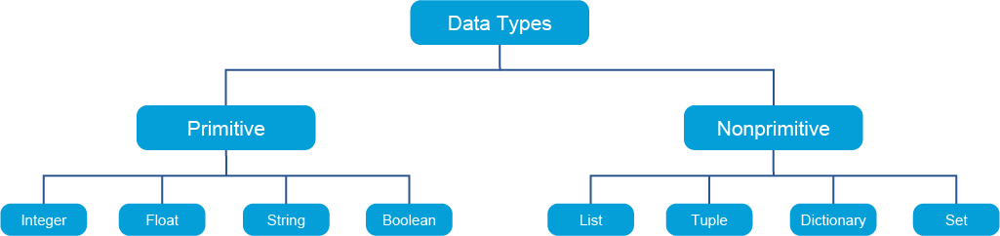
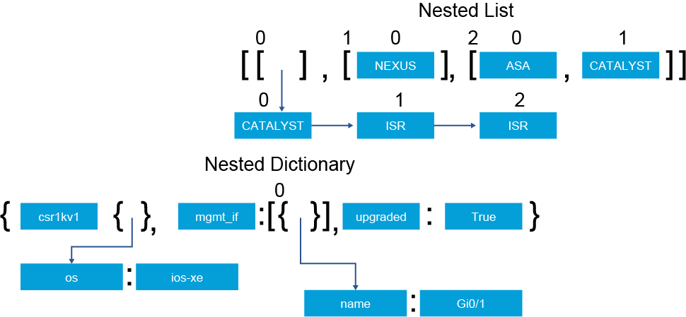
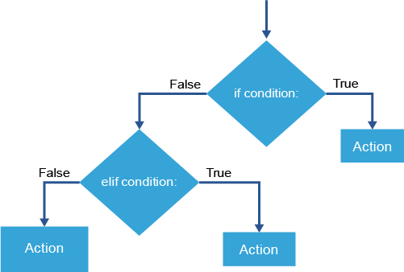
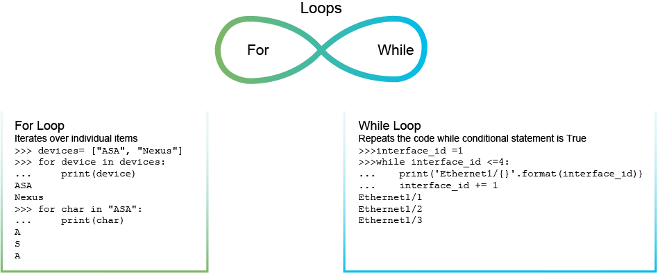

# Python Data Types

Like any programming language, Python supports different data types. Each supported type can be divided into two categories: primitive and nonprimitive. Primitive data types are represented in their basic form. Nonprimitive data types are intended to organize and manage primitive data types. These primitive types store single values.



These examples of data types from each category will help you understand how to define and use them in Python code.

Primitive Data Types
- **Integer**: Any whole number is an integer. 

```
>>> ssh_timeout = 30
>>> error_code= -1
```

- **Float**: This data type is a floating point number, and any number with a decimal point is considered as a float.

```
>>> ios_version = 15.8
```

- **String**: Any alphanumeric characters that are enclosed within a pair of single or double quotation marks is a string. 

```
>>> leaf_switch  = "Nexus 9300"
>>> spine_switch = "Nexus 9336PQ"
```

- **Boolean**: This data type can accept only two values: True or False. 

```
>>> code_upgraded = True
>>> errors_observed = False
```

## Nonprimitive Data Types
- **List**: Any data that is enclosed within square brackets ( [] ) and separated by a comma is considered a list. 

```
>>> devices = ["ASA", "NEXUS", "CATALYST", "ASR"]
```

- **Tuple**: Any data that is enclosed within parenthesis ( ( ) ) and separated by a comma is considered a tuple. Tuples are immutable, which means that data that is stored in a tuple cannot be modified at run time. The following is a tuple of IP addresses.

```
 >>> ip_addr = ("10.254.0.1", "10.254.0.2", "10.254.0.3")
 >>> ip_addr[1]
 '10.254.0.2'
 >>> ip_addr[1] = "10.254.1.2"
 Traceback (most recent call last):
  File "<stdin>", line 1, in <module> 
 TypeError: 'tuple' object does not support item assignment
```

- **Dictionary**: Any key-value pairs that are enclosed in curly brackets ( {  } ) and separated by a comma is a dictionary. The following dictionary has keys that are equal to interface names and values with the desired state of the interface. 

```
>>> if_state = {"Gi0/1":"shutdown", "Gi0/2":"no shutdown"}
```

- **Set**: A collection of unique objects that is enclosed curly  brackets ( {  } ) and separated by a comma is considered a set. 

```
 >>> if_names = {"Gi0/1", "Gi0/2", "Gi0/3", "Gi0/1"}
 >>> if_names
 {'Gi0/1', 'Gi0/2', 'Gi0/3'}
```

Primitive data types can be converted to other primitive types using built-in functions with an assumption that the converted value is valid.

```
  >>> bool(1)
 True
 >>> int(False)
 0
 >>> float("3.14")
 3.14
```

Some nonprimitive data types can also be converted to other (similar) data types. For example, a list can be converted to a set or a tuple, but cannot be converted to a dictionary. 

```
 >>> devices= ["ASA", "NEXUS", "CATALYST", "NEXUS", "asa"]
 >>> set(devices)
 {'NEXUS', 'ASA', 'asa', 'CATALYST'}
```

As shown in the output, the devices list contains a duplicate entry of "NEXUS", but when converted to the set data type, it was removed. Note that set removes items based on case sensitivity. From the previous output, you can see that 'ASA' and 'asa' are still present in the set because they are different values.

It is possible to convert a list to a tuple, but the variable that holds the converted tuple can no longer be modified. Here you can see an example:

```
 >>> cisco_devices = tuple(devices)
 ('ASA', 'NEXUS', 'CATALYST')
 >>> cisco_devices
 ('ASA', 'NEXUS', 'CATALYST', 'NEXUS', 'asa')
 >>> cisco_devices[-1] = "FTD"
 Traceback (most recent call last):
  File "<stdin>", line 1, in <module> 
 TypeError: 'tuple' object does not support item assignment
```

As mentioned earlier, it is not possible to convert one data type to another if the converted value is invalid. For example, if you attempt to convert a list to a dictionary, an error will be raised. Here is an example of such an error:

```
 >>> dict(devices)
 Traceback (most recent call last):
  File "<stdin>", line 1, in <module> 
 ValueError: dictionary update sequence element #0 has length 3; 2 is required
```

Each data type that was mentioned previously supports different built-in methods and attributes. To list the methods that can be used on a particular data type, create a variable with that type and then issue the dir() built-in method. Here you see an example of methods that can be used on the string data types. 

```
 >>> vendor = "Cisco"
 >>> dir(vendor)
 ['__add__', '__class__', '__contains__', '__delattr__', '__dir__', '__doc__', '__eq__', '__format__', '__ge__', '__getattribute__', '__getitem__', '__getnewargs__', '__gt__', '__hash__', '__init__', '__iter__', '__le__', '__len__', '__lt__', '__mod__', '__mul__', '__ne__', '__new__', '__reduce__', '__reduce_ex__', '__repr__', '__rmod__', '__rmul__', '__setattr__', '__sizeof__', '__str__', '__subclasshook__', 'capitalize', 'casefold', 'center', 'count', 'encode', 'endswith', 'expandtabs', 'find', 'format', 'format_map', 'index', 'isalnum', 'isalpha', 'isdecimal', 'isdigit', 'isidentifier', 'islower', 'isnumeric', 'isprintable', 'isspace', 'istitle', 'isupper', 'join', 'ljust', 'lower', 'lstrip', 'maketrans', 'partition', 'replace', 'rfind', 'rindex', 'rjust', 'rpartition', 'rsplit', 'rstrip', 'split', 'splitlines', 'startswith', 'strip', 'swapcase', 'title', 'translate', 'upper', 'zfill']
```

If you want to convert a string to all capital letters, then you need to use the upper() method. 

```
 >>> vendor.upper()
 CISCO
```

To learn how to use each method, you can use the help() function.

```
 >>> help(vendor.upper)

 Help on built-in function upper:

upper() method of builtins.str instance
    Return a copy of the string converted to uppercase.
```

Now you have an understanding of the different data types that Python supports. You can expand that knowledge with the following slightly more advanced topic: nested nonprimitive data types.

 

Nested data structures are only applicable to nonprimitive types. Each nonprimitive type can contain the same or other nonprimitive data types as nested entries. 

For example, a nested list can contain a dictionary as a nested item:

```
 >>> if_state = ["Gi0/1", [{"state": "shutdown"}]]
```

To access the value inside the nested list without looping through the list, you first need to identify its position in the list. Because lists are ordered, and the positions, starting from 0, are incremented from left to right by 1, the position for the nested dictionary will be 1.

Now, to refer to the position, you need to put an integer within the square brackets: 

```
 >>> if_state[1]
 [{"state": "shutdown"}]
```

However, that will only give you the [{"state": "shutdown"}] item, because it is also a list, and has only one value that can be referenced with its positional number:

```
 >>> if_state[1][0]
 {"state": "shutdown"}
```

At this point, what remains is a dictionary. Now you can print the value of the key by appending the name of the key to the variable that precedes the position in the list: 

```
 >>> if_state[1][0]["state"]
 shutdown
```

Now, consider a nested dictionary. As you know, dictionaries are not sorted, so the position of a key cannot be referenced. Instead, it can be referenced directly by specifying its name and enclosing it in square brackets. Here is an example: 

```
 >>> facts ={"csr1kv1": {"os":"ios-xe", "version":"16.09.03"}, "if_state": [{"name": "Gi0/1", "state":"shutdown"}]}
```

You can obtain nested values that are stored under each root key. In this example, start with csr1kv1. To return the value stored in the key, you enclose the key’s name in square brackets and append it to the variable.

```
 >>> facts["csr1kv1"]
 {"os":"ios-xe", "version":"16.09.03"}
```

The returned value is another dictionary. To return the value of the nested key, you need to add its name after the name of the root key. 

```
 >>> facts["csr1kv1"]["os"]
 ios-xe
 >>> facts["csr1kv1"]["version"]
 16.09.03
```

Now consider the second root key. As you can see, the value is a list, so you need to act accordingly. You need to obtain the value, pick the position within the list, and then use the key name to return the value. 

```
 >>> facts["if_state"]
 [{"name”: "Gi0/1", "state":"shutdown"}]
 >>> facts["if_state"][0]
 {"name": "Gi0/1", "state":"shutdown"} 
 >>> facts["if_state"][0]["name"]
 Gi0/1
```

Understanding how to find the position in nested lists is crucial in day-to-day programming, especially when you are dealing with API calls. You are therefore encouraged to open the Python interpreter and create a nested list with different depths and try finding the values that interest you. 

---

# Python Conditionals
In Python, conditional statements are used to perform different actions depending on whether a condition evaluates as true or false.

- Conditional Statements

    - if, elif, else

- Comparison Operators

    - ==, !=, <, >, <=, >=

- Boolean Operators

    - and, or, not

- Membership Operators

    - in, not in 

- Identity Operators 

    - is, is not



To easily evaluate a statement, you can use different built-in operators like comparison ( == ). This operator compares the value on the left side to the value on the right side and determines if they are equal (True) or not equal (False). 

Here is a list of operators that can be used during different evaluations:

- Comparison operators:

    - **==**   : This operator compares whether values on the left and right side are equal.

    - **!=**   : This operator compares whether values on the left and right side are not equal.

    - **<**   : This operator compares whether the value on the left is less than the value on the right.

    - **>**   : This operator compares whether the value on the left is greater than the value on the right.

    - **<=**   : This operator compares whether the value on the left is less than or equal to the value on the right

    - **>=**   : This operator compares whether the value on the left is greater than or equal to the value on the right.

- Boolean operators:

    - **and**: This operator requires that both statements are true.

    - **or**: This operator allows either of the statements to be true.

    - **not**: This operator returns the value that is the opposite of the original statement (true for false; false for true).

- Membership operators:

    - **in**: This operator checks whether the value on the left exists in the value on the right.

    - **not in**: This operator checks whether the value on the left does not exist in the value on the right.

- Identity operators:

    - **is**: This operator compares whether the value that is assigned to the variable on the left is the same as the   value that is assigned to the variable to the right

    - **is not**: This operator compares whether the value that is assigned to the variable on the left is not the same as the value that is assigned to the variable to the right.  

Now you can apply the operators to the conditional statements. There are three conditional statements in Python: if, elif, and else. The if condition starts the statement evaluation process. If the statement is true, then an action is executed and the code block is exited. If statement is false, then an optional elif conditional check can be used to evaluate another statement for being true or false. If all conditional statements evaluate to false, then the else clause can be used to execute a line of code. 

In addition, the conditional checks can be nested:

```
 >>> if hostname == "csr1kv-1":
 …       if os_version == "16.09.03":
 …           print("Device {hostname} is running version {os_version}".format(hostname=hostname, os_version=os_version))
 …       else:
 …           print("Device {hostname} is running unknown version of os".format(hostname=hostname))
 ```

---

# Python Loops and Functions
Manually obtaining a value from a nested dictionary or list is not very practical. In addition, it is not very practical to have a repetitive code that checks if a value has changed. To address those types of scenarios, you will need to use proper tools within Python. To address the first problem, you will use a for loop and to address the second one, you will use a while loop. The explanation of each loop type and supporting examples are as follows:



# For Loops
Unlike other programming languages, the Python "for" loop does not evaluate a statement before running the underlying code; instead, it iterates over a provided object. The Python "for" loop is like a “for each” loop in other languages.

The given object being “looped over” or “iterated over” can be a primitive string, range, or nonprimitive (list, dictionary, tuple, or a set) data type. The syntax of a for loop is as follows: for variable_name in object_of_iteration: 

- **variable_name**: This temporary variable holds data that are relevant to that iteration cycle. A good general principle is to give the temporary variable a name that describes the data it will hold. For example, if you are iterating over VLANs, then name the variable “vlan,” for example, for vlan in vlans: A more generic name that is often used is “item,” for example, for item in vlans:.

- **in**: This variable is a membership operator.

- **object_of_iteration**: This variable name is being looped (iterated) through.

Example:

```
 >>> vlans = [100, 200, 300]
 >>> for vlan in vlans:
 . . .   print(vlan)
 100
 200
 300  
```

## While Loops
“While” is another looping method that Python supports, but instead of iterating over an object, the while loop executes underlying code until the supplied condition is true. This mechanism is very useful, but it requires attention. Because underlying code is running while the condition is true, it is possible to enter an infinite-looping state during which code runs forever and can negatively affect the host on which the code is running. 

Example:

```
 >>> interface_id =1
 >>> while interface_id <=4:
 ...     print('Ethernet1/{}'.format(interface_id))
 ...     interface_id += 1
 Ethernet1/1
 Ethernet1/2
 Ethernet1/3
 Ethernet1/4
```

# Python Functions 
All programming languages, including Python, can create blocks of organized and reusable code that are called functions. Functions provide efficiency, consistency, and modularity. Functions can be built-in, written in the code, or can be imported from other Python scripts.

- Create reusable code

- Wrap standard Python code within a function definition  

```
 >>> def issue_command(hostname, command):
 ...     print("Connecting to device: {}".format(hostname))
 ...     print("Issuing the following command: {}".format(command))
 ...
 >>>
 >>> issue_command('nycr1', 'show version')
 Connecting to device: nycr1
 Issuing the following command: show version
 >>>
```

Functions might require arguments to be provided when called and optionally return data for further processing. 

The following examples illustrate functions and how to use them:

- User-defined function:

```
 >>> def hostname_conf(name):
 ...     return 'hostname {}'.format(name)
 ...
 >>> print(hostname_conf('csr1kv-1'))
 hostname csr1kv-1
```

- Built-in functions:

```
 >>> len(vlans)
 1
 >>> str(100)
 '100'
 >>> int(3.14)
 3
```