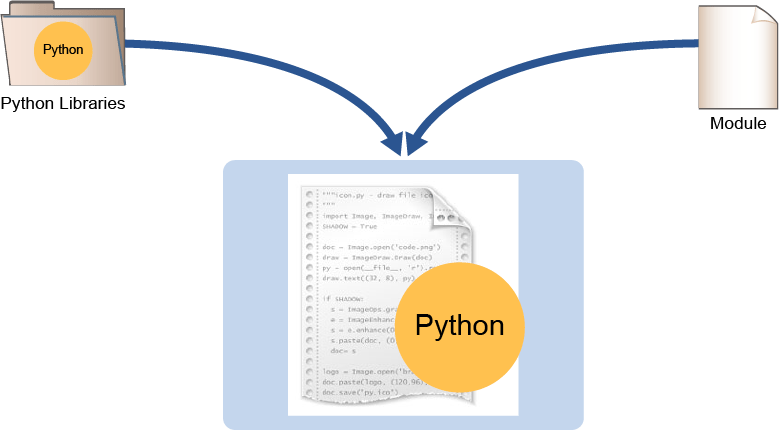

# Python Data Types

Like any programming language, Python supports different data types. Each supported type can be divided into two categories: primitive and nonprimitive. Primitive data types are represented in their basic form. Nonprimitive data types are intended to organize and manage primitive data types. These primitive types store single values.


These examples of data types from each category will help you understand how to define and use them in Python code.

Primitive Data Types
- **Integer**: Any whole number is an integer. 

```
>>> ssh_timeout = 30
>>> error_code= -1
```

- **Float**: This data type is a floating point number, and any number with a decimal point is considered as a float.

```
>>> ios_version = 15.8
```

- **String**: Any alphanumeric characters that are enclosed within a pair of single or double quotation marks is a string. 

```
>>> leaf_switch  = "Nexus 9300"
>>> spine_switch = "Nexus 9336PQ"
```

- **Boolean**: This data type can accept only two values: True or False. 

```
>>> code_upgraded = True
>>> errors_observed = False
```

## Nonprimitive Data Types
- **List**: Any data that is enclosed within square brackets ( [] ) and separated by a comma is considered a list. 

```
>>> devices = ["ASA", "NEXUS", "CATALYST", "ASR"]
```

- **Tuple**: Any data that is enclosed within parenthesis ( ( ) ) and separated by a comma is considered a tuple. Tuples are immutable, which means that data that is stored in a tuple cannot be modified at run time. The following is a tuple of IP addresses.

```
 >>> ip_addr = ("10.254.0.1", "10.254.0.2", "10.254.0.3")
 >>> ip_addr[1]
 '10.254.0.2'
 >>> ip_addr[1] = "10.254.1.2"
 Traceback (most recent call last):
  File "<stdin>", line 1, in <module> 
 TypeError: 'tuple' object does not support item assignment
```

- **Dictionary**: Any key-value pairs that are enclosed in curly brackets ( {  } ) and separated by a comma is a dictionary. The following dictionary has keys that are equal to interface names and values with the desired state of the interface. 

```
>>> if_state = {"Gi0/1":"shutdown", "Gi0/2":"no shutdown"}
```

- **Set**: A collection of unique objects that is enclosed curly  brackets ( {  } ) and separated by a comma is considered a set. 

```
 >>> if_names = {"Gi0/1", "Gi0/2", "Gi0/3", "Gi0/1"}
 >>> if_names
 {'Gi0/1', 'Gi0/2', 'Gi0/3'}
```

Primitive data types can be converted to other primitive types using built-in functions with an assumption that the converted value is valid.

```
  >>> bool(1)
 True
 >>> int(False)
 0
 >>> float("3.14")
 3.14
```

Some nonprimitive data types can also be converted to other (similar) data types. For example, a list can be converted to a set or a tuple, but cannot be converted to a dictionary. 

```
 >>> devices= ["ASA", "NEXUS", "CATALYST", "NEXUS", "asa"]
 >>> set(devices)
 {'NEXUS', 'ASA', 'asa', 'CATALYST'}
```

As shown in the output, the devices list contains a duplicate entry of "NEXUS", but when converted to the set data type, it was removed. Note that set removes items based on case sensitivity. From the previous output, you can see that 'ASA' and 'asa' are still present in the set because they are different values.

It is possible to convert a list to a tuple, but the variable that holds the converted tuple can no longer be modified. Here you can see an example:

```
 >>> cisco_devices = tuple(devices)
 ('ASA', 'NEXUS', 'CATALYST')
 >>> cisco_devices
 ('ASA', 'NEXUS', 'CATALYST', 'NEXUS', 'asa')
 >>> cisco_devices[-1] = "FTD"
 Traceback (most recent call last):
  File "<stdin>", line 1, in <module> 
 TypeError: 'tuple' object does not support item assignment
```

As mentioned earlier, it is not possible to convert one data type to another if the converted value is invalid. For example, if you attempt to convert a list to a dictionary, an error will be raised. Here is an example of such an error:

```
 >>> dict(devices)
 Traceback (most recent call last):
  File "<stdin>", line 1, in <module> 
 ValueError: dictionary update sequence element #0 has length 3; 2 is required
```

Each data type that was mentioned previously supports different built-in methods and attributes. To list the methods that can be used on a particular data type, create a variable with that type and then issue the dir() built-in method. Here you see an example of methods that can be used on the string data types. 

```
 >>> vendor = "Cisco"
 >>> dir(vendor)
 ['__add__', '__class__', '__contains__', '__delattr__', '__dir__', '__doc__', '__eq__', '__format__', '__ge__', '__getattribute__', '__getitem__', '__getnewargs__', '__gt__', '__hash__', '__init__', '__iter__', '__le__', '__len__', '__lt__', '__mod__', '__mul__', '__ne__', '__new__', '__reduce__', '__reduce_ex__', '__repr__', '__rmod__', '__rmul__', '__setattr__', '__sizeof__', '__str__', '__subclasshook__', 'capitalize', 'casefold', 'center', 'count', 'encode', 'endswith', 'expandtabs', 'find', 'format', 'format_map', 'index', 'isalnum', 'isalpha', 'isdecimal', 'isdigit', 'isidentifier', 'islower', 'isnumeric', 'isprintable', 'isspace', 'istitle', 'isupper', 'join', 'ljust', 'lower', 'lstrip', 'maketrans', 'partition', 'replace', 'rfind', 'rindex', 'rjust', 'rpartition', 'rsplit', 'rstrip', 'split', 'splitlines', 'startswith', 'strip', 'swapcase', 'title', 'translate', 'upper', 'zfill']
```

If you want to convert a string to all capital letters, then you need to use the upper() method. 

```
 >>> vendor.upper()
 CISCO
```

To learn how to use each method, you can use the help() function.

```
 >>> help(vendor.upper)

 Help on built-in function upper:

upper() method of builtins.str instance
    Return a copy of the string converted to uppercase.
```

Now you have an understanding of the different data types that Python supports. You can expand that knowledge with the following slightly more advanced topic: nested nonprimitive data types.

 

Nested data structures are only applicable to nonprimitive types. Each nonprimitive type can contain the same or other nonprimitive data types as nested entries. 

For example, a nested list can contain a dictionary as a nested item:

```
 >>> if_state = ["Gi0/1", [{"state": "shutdown"}]]
```

To access the value inside the nested list without looping through the list, you first need to identify its position in the list. Because lists are ordered, and the positions, starting from 0, are incremented from left to right by 1, the position for the nested dictionary will be 1.

Now, to refer to the position, you need to put an integer within the square brackets: 

```
 >>> if_state[1]
 [{"state": "shutdown"}]
```

However, that will only give you the [{"state": "shutdown"}] item, because it is also a list, and has only one value that can be referenced with its positional number:

```
 >>> if_state[1][0]
 {"state": "shutdown"}
```

At this point, what remains is a dictionary. Now you can print the value of the key by appending the name of the key to the variable that precedes the position in the list: 

```
 >>> if_state[1][0]["state"]
 shutdown
```

Now, consider a nested dictionary. As you know, dictionaries are not sorted, so the position of a key cannot be referenced. Instead, it can be referenced directly by specifying its name and enclosing it in square brackets. Here is an example: 

```
 >>> facts ={"csr1kv1": {"os":"ios-xe", "version":"16.09.03"}, "if_state": [{"name": "Gi0/1", "state":"shutdown"}]}
```

You can obtain nested values that are stored under each root key. In this example, start with csr1kv1. To return the value stored in the key, you enclose the key’s name in square brackets and append it to the variable.

```
 >>> facts["csr1kv1"]
 {"os":"ios-xe", "version":"16.09.03"}
```

The returned value is another dictionary. To return the value of the nested key, you need to add its name after the name of the root key. 

```
 >>> facts["csr1kv1"]["os"]
 ios-xe
 >>> facts["csr1kv1"]["version"]
 16.09.03
```

Now consider the second root key. As you can see, the value is a list, so you need to act accordingly. You need to obtain the value, pick the position within the list, and then use the key name to return the value. 

```
 >>> facts["if_state"]
 [{"name”: "Gi0/1", "state":"shutdown"}]
 >>> facts["if_state"][0]
 {"name": "Gi0/1", "state":"shutdown"} 
 >>> facts["if_state"][0]["name"]
 Gi0/1
```

Understanding how to find the position in nested lists is crucial in day-to-day programming, especially when you are dealing with API calls. You are therefore encouraged to open the Python interpreter and create a nested list with different depths and try finding the values that interest you. 

---

# Python Conditionals
In Python, conditional statements are used to perform different actions depending on whether a condition evaluates as true or false.

- Conditional Statements

    - if, elif, else

- Comparison Operators

    - ==, !=, <, >, <=, >=

- Boolean Operators

    - and, or, not

- Membership Operators

    - in, not in 

- Identity Operators 

    - is, is not


To easily evaluate a statement, you can use different built-in operators like comparison ( == ). This operator compares the value on the left side to the value on the right side and determines if they are equal (True) or not equal (False). 

Here is a list of operators that can be used during different evaluations:

- Comparison operators:

    - **==**   : This operator compares whether values on the left and right side are equal.

    - **!=**   : This operator compares whether values on the left and right side are not equal.

    - **<**   : This operator compares whether the value on the left is less than the value on the right.

    - **>**   : This operator compares whether the value on the left is greater than the value on the right.

    - **<=**   : This operator compares whether the value on the left is less than or equal to the value on the right

    - **>=**   : This operator compares whether the value on the left is greater than or equal to the value on the right.

- Boolean operators:

    - **and**: This operator requires that both statements are true.

    - **or**: This operator allows either of the statements to be true.

    - **not**: This operator returns the value that is the opposite of the original statement (true for false; false for true).

- Membership operators:

    - **in**: This operator checks whether the value on the left exists in the value on the right.

    - **not in**: This operator checks whether the value on the left does not exist in the value on the right.

- Identity operators:

    - **is**: This operator compares whether the value that is assigned to the variable on the left is the same as the   value that is assigned to the variable to the right

    - **is not**: This operator compares whether the value that is assigned to the variable on the left is not the same as the value that is assigned to the variable to the right.  

Now you can apply the operators to the conditional statements. There are three conditional statements in Python: if, elif, and else. The if condition starts the statement evaluation process. If the statement is true, then an action is executed and the code block is exited. If statement is false, then an optional elif conditional check can be used to evaluate another statement for being true or false. If all conditional statements evaluate to false, then the else clause can be used to execute a line of code. 

In addition, the conditional checks can be nested:

```
 >>> if hostname == "csr1kv-1":
 …       if os_version == "16.09.03":
 …           print("Device {hostname} is running version {os_version}".format(hostname=hostname, os_version=os_version))
 …       else:
 …           print("Device {hostname} is running unknown version of os".format(hostname=hostname))
 ```

---

# Python Loops and Functions
Manually obtaining a value from a nested dictionary or list is not very practical. In addition, it is not very practical to have a repetitive code that checks if a value has changed. To address those types of scenarios, you will need to use proper tools within Python. To address the first problem, you will use a for loop and to address the second one, you will use a while loop. The explanation of each loop type and supporting examples are as follows:


# For Loops
Unlike other programming languages, the Python "for" loop does not evaluate a statement before running the underlying code; instead, it iterates over a provided object. The Python "for" loop is like a “for each” loop in other languages.

The given object being “looped over” or “iterated over” can be a primitive string, range, or nonprimitive (list, dictionary, tuple, or a set) data type. The syntax of a for loop is as follows: for variable_name in object_of_iteration: 

- **variable_name**: This temporary variable holds data that are relevant to that iteration cycle. A good general principle is to give the temporary variable a name that describes the data it will hold. For example, if you are iterating over VLANs, then name the variable “vlan,” for example, for vlan in vlans: A more generic name that is often used is “item,” for example, for item in vlans:.

- **in**: This variable is a membership operator.

- **object_of_iteration**: This variable name is being looped (iterated) through.

Example:

```
 >>> vlans = [100, 200, 300]
 >>> for vlan in vlans:
 . . .   print(vlan)
 100
 200
 300  
```

## While Loops
“While” is another looping method that Python supports, but instead of iterating over an object, the while loop executes underlying code until the supplied condition is true. This mechanism is very useful, but it requires attention. Because underlying code is running while the condition is true, it is possible to enter an infinite-looping state during which code runs forever and can negatively affect the host on which the code is running. 

Example:

```
 >>> interface_id =1
 >>> while interface_id <=4:
 ...     print('Ethernet1/{}'.format(interface_id))
 ...     interface_id += 1
 Ethernet1/1
 Ethernet1/2
 Ethernet1/3
 Ethernet1/4
```

# Python Functions 
All programming languages, including Python, can create blocks of organized and reusable code that are called functions. Functions provide efficiency, consistency, and modularity. Functions can be built-in, written in the code, or can be imported from other Python scripts.

- Create reusable code

- Wrap standard Python code within a function definition  

```
 >>> def issue_command(hostname, command):
 ...     print("Connecting to device: {}".format(hostname))
 ...     print("Issuing the following command: {}".format(command))
 ...
 >>>
 >>> issue_command('nycr1', 'show version')
 Connecting to device: nycr1
 Issuing the following command: show version
 >>>
```

Functions might require arguments to be provided when called and optionally return data for further processing. 

The following examples illustrate functions and how to use them:

- User-defined function:

```
 >>> def hostname_conf(name):
 ...     return 'hostname {}'.format(name)
 ...
 >>> print(hostname_conf('csr1kv-1'))
 hostname csr1kv-1
```

- Built-in functions:

```
 >>> len(vlans)
 1
 >>> str(100)
 '100'
 >>> int(3.14)
 3
```

# Practice Quiz for Python Fundamentals

**Question 1**
A variable of the list data type that is named devices has the following value: [{"hostname":"csr1kv1"}]. Which Python command will print the value of the "hostname" key?

The correct answer is: "print(devices[0]["hostname"])." The variable devices is a list data type that contains a single entry which is a dictionary data type. Lists have ordered positions, and the first entry is index "0". Dictionaries are made of key-value pairs. To retrieve a value from a dictionary, you need the key, and in this case, the key is "hostname". Therefore, the print statement prints the dictionary value that is in index "0" of the list with the key "hostname" in the dictionary.


**Question 2**
Refer to the following Python script. Which message will be printed?

```
models=["ASA", "NEXUS", "CATALYST"]
if "asa" in models:
    print("models variable contains ASA")
elif "nexus".upper() in models:
    print("models variable contains NEXUS")
elif models[-1] == "CATALYST":
    print("models variable contains CATALYST")
else:
    print("No Match Was Found!")
```

**models variable contains NEXUS**

This is correct because when the conditional statement on line 4 evaluates the model object, it is true, which will then execute the following indented command. Once evaluated as true, no further conditional statements are then evaluated.

**Question 3**
Which is the correct syntax to define a function?


**def print_hostname():**

This is the correct format for writing a Python function.

---

# Network Libraries
A software library is collection of a prewritten code to assist developers during their software creation process. From Python’s perspective, here is a breakdown of the available prewritten code.


A module is a single file that contains Python objects that can be reused in scripts.

A package is a collection of modules, in one or more directories, to streamline and modularize development of the package.

The term “library” is often used to refer to a collection of modules or packages. Very often the standard modules that come with an install of Python are referred to as the “Python standard library.”

Libraries can come from different sources. In Python, people who are responsible for Python itself develop and maintain libraries. Again, this library is the standard library.

However, Python is not limited to the standard library. Developers can download libraries from open source and public communities that are often found on GitHub or the Python Package Index (PyPI). 

The last type of library is one that is developed in a company for a specific purpose. These libraries are customized, in-house libraries. For example, large clients may have in-house libraries and code to provision different pods for requesting users. This code is customized, not public, and is usually specific to a use case.

## Modules and Packages 


The difference between the Python module and the Python package was mentioned earlier. A module is a single file with the .py extension that contains some usable code. A package is a collection of modules that is stored in a folder where the name of the folder is the name of the package. 

You might be wondering how you can differentiate a package from a module in the Python code itself. You can make this distinction when a module is imported and a single file is referenced. For example, import Netmiko or from Netmiko, import ConnectHandler. If you want to import a module from a package, then you must use “dotted module names.” For example, you could use 

```
 >>> import cobra.mit.access
```
 or
```
 >>> from cobra.mit.access import MoDirectory 
```

where each name that is followed by a dot represents a folder and the last entry in the chain represents a file (module).


## Use the PYTHONPATH


By default, you can be in any directory to use the Python standard library. For other software, and maybe custom modules, you may write a script. The script must be stored in one of two locations: the local directory where the script is saved or within the PYTHONPATH environment variable. The PYTHONPATH is a list of directories that the system will search for Python modules and packages when doing imports in a script. It is quite common to update the PYTHONPATH in a login script such as .profile.

You can check the PYTHONPATH on the Linux shell using the env command to see any custom paths that have been added. To see all available directories that Python will search, you can easily check from the Python shell using the **sys.path** command:

```
 >>> import sys
 >>> print(sys.path)
 ['', '/usr/lib/python36.zip', '/usr/lib/python3.6', '/usr/lib/python3.6/lib-dynload', '/home/student/.local/lib/python3.6/site-packages', '/usr/local/lib/python3.6/dist-packages', '/usr/lib/python3/dist-packages']
```

## Import Statements
Import statements help you perform many tasks.



The following provides a description of the different import methods and what they do:

- **import netmiko**: This method will import everything in the Netmiko module. Suppose that Netmiko has a variable called VERSION that is defined in its file. To use that variable, you will need to use the following format to refer to it: netmiko.VERSION. The same requirement applies to the classes and functions. ConnectHandler is part of the Netmiko module and you can use it by following the same syntax: netmiko.ConnectHandler().

- **from netmiko import ConnectHandler**: This method tells python to extract the object (in this instance, the object is the ConnectHandler) from the module and make it directly callable. Directly callable means that you do not need to refer to the module name and the object. Instead, you can use the class name directly. The same approach applies to the functions and variables.

- **from netmiko import ConnectHandler as ch**: Some objects have really long names, and to make them shorter, you can create aliases of the original object. Now, instead of ConnectHandler, you can use ch.


## Free Open Source Software 
Python software is available in many places. There is a growing community of network developers who host their code on GitHub including Cisco DevNet, which has several free and open source projects on the DevNet Code Exchange, a curated collection of example code and projects.


You can find several Cisco libraries on the CiscoDevNet GitHub page: https://github.com/CiscoDevNet

Two Python packages that are open source and quite popular in the network industry are Netmiko and Network Automation and Programmability Abstraction Layer with Multivendor (NAPALM):

- Netmiko: This package is a multivendor SSH library for Python to simplify Paramiko SSH connections to network devices: 
[https://github.com/ktbyers/netmiko](https://github.com/ktbyers/netmiko)

- NAPALM: This package implements a set of functions that interact with different network device operating systems using a unified API: 
[https://github.com/napalm-automation/napalm](https://github.com/napalm-automation/napalm)

---

# Inside Python Modules

Remember that a Python module is simply a Python file that has one or more Python objects, such as variables, functions, and classes. Now you will examine the inside of a Python module.


Keep in mind that modules can use other modules. This process is possible using import statements just like you would do if you were writing a script (not a module).

Here are some examples of Python modules:

- **device_data.py**

```
 USERNAME = "cisco"
 PASSWORD = "cisco"
 DEVICE_TYPE = "cisco_xe"
 INVENTORY = ["csr1kv1", "csr1kv2", "csr1kv3"]
```

This module only has variables. Other Python scripts and other Python modules can use these variables. Here is an example of a script that uses the device_data.py module:

- **automation_code.py**

```
 import device_data
 print(device_data.USERNAME)
 print(device_data.INVENTORY)
```

There are many ways to import data within a script from a module. Here are a few other examples that could have been used:

```
 import device_data as dd
 print(dd.USERNAME)

 from device_data import USERNAME
 print(USERNAME)

 from device_data import USERNAME as user
 print(user)

 from device_data import PASSWORD
 print(PASSWORD) 

Python classes and functions can also be saved in a module file and can be referenced in any other Python code.
```

- **cisco_networks.py**

```
 def print_routers():
    ... 
 def verify_bgp(device):
    ... 
 def configure_bgp():
    ...
```

- **automation.py**

## Constructing a Module


As you have seen already, it is quite straightforward to create a Python module once you know Python fundamentals. Now you will look at an example that contains a small device inventory and a basic Python function that prints each device name in the inventory.

The example will use the Python interpreter. The devnet.py file is a custom module for this class that resides in /home/student/modules folder.

```
student@student-vm:~$ cat modules/devnet.py
 inventory = {
    "csr1kv1": { 
        "username": "cisco", 
        "password": "cisco", 
        "device_type": "cisco_ios", 
    }, 
    "csr1kv2": { 
        "username": "cisco", 
        "password": "cisco", 
        "device_type": "cisco_ios", 
    }, 
 }

 def print_routers():
    for router in inventory: 
        print(router) 

 def verify_bgp():
    print("BGP session is active") 

 def configure_bgp():
    for router in inventory: 
        print("Configuring BGP for {} ".format(router))
```

The Python interpreter is opened by typing the **python** command. Note: The present working directory is /home/student.

 student@student-vm:~$ **python**
 ```
 Python 3.6.8 (default, Jan 14 2019, 11:02:34)
 [GCC 8.0.1 20180414 (experimental) [trunk revision 259383]] on linux
 Type "help", "copyright", "credits" or "license" for more information.
 >>> 
```

If you attempt to import the module immediately, it will fail. 

```
 >>> import devnet
 Traceback (most recent call last):
  File "<stdin>", line 1, in <module> 
 ModuleNotFoundError: No module named 'devnet'
```

There are four options to resolve the problem: 

- Change your present working directory to the modules folder, then start the interpreter (this option is the easiest). 

- Create a special file in the modules folder named __init__.py (completely empty), which will make your folder a package.

- Add the modules folder to your PYTHONPATH environmental variable. 

- Copy the devnet.py module to a folder that exists in PYTHONPATH.


Here are the options in operation:

- **Option 1**: Change the working directory.

```
 >>> quit()
 student@student-vm:~$ cd modules
 student@student-vm:~/modules$ python
 Python 3.6.8 (default, Jan 14 2019, 11:02:34)
 [GCC 8.0.1 20180414 (experimental) [trunk revision 259383]] on linux
 Type "help", "copyright", "credits" or "license" for more information.
 >>> import devnet
 >>> print(devnet.inventory)
 {'csr1kv1': {'username': 'cisco', 'password': 'cisco', 'device_type': 'cisco_ios'}, 'csr1kv2': {'username': 'cisco', 'password': 'cisco', 'device_type': 'cisco_ios'}}
```

- Option 2: Create the __init__.py file in the modules folder:

```
 >>> quit()
 student@student-vm:~$ touch modules/__init__.py
 student@student-vm:~$ python
 Python 3.6.8 (default, Jan 14 2019, 11:02:34)
 [GCC 8.0.1 20180414 (experimental) [trunk revision 259383]] on linux
 Type "help", "copyright", "credits" or "license" for more information.
 >>> import modules.devnet
 >>> print(modules.devnet.inventory)
 {'csr1kv1': {'username': 'cisco', 'password': 'cisco', 'device_type': 'cisco_ios'}, 'csr1kv2': {'username': 'cisco', 'password': 'cisco', 'device_type': 'cisco_ios'}}
```

- **Option 3**: Add the modules folder to the PYTHONPATH environmental variable.

```
 >>> import sys
 >>> sys.path.insert(1, '/home/student/modules/') #sys.path is a list and we can invoke any methods a list supports
 >>> import devnet
 >>> print(devnet.inventory)
 {'csr1kv1': {'username': 'cisco', 'password': 'cisco', 'device_type': 'cisco_ios'}, 'csr1kv2': {'username': 'cisco', 'password': 'cisco', 'device_type': 'cisco_ios'}}
```

You should update .bashrc in your home directory to add to the PYTHONPATH if you need the PYTHONPATH to have a new directory search for all apps. 

- **Option 4**. Copy your module to a folder that exists in the PYTHONPATH environmental variable. (Superuser permission is required.  

```
 >>> import sys
 >>> sys.path
 ['', '/usr/lib/python36.zip', '/usr/lib/python3.6', '/usr/lib/python3.6/lib-dynload', '/home/student/.local/lib/python3.6/site-packages', '/usr/local/lib/python3.6/dist-packages', '/usr/lib/python3/dist-packages']
 >>> quit()
 student@student-vm:~$ sudo cp modules/devnet.py /usr/lib/python3/dist-packages/
 student@student-vm:~$ python
 Python 3.6.8 (default, Jan 14 2019, 11:02:34)
 [GCC 8.0.1 20180414 (experimental) [trunk revision 259383]] on linux
 Type "help", "copyright", "credits" or "license" for more information.
 >>> import devnet
 >>> print(devnet.inventory)
 {'csr1kv1': {'username': 'cisco', 'password': 'cisco', 'device_type': 'cisco_ios'}, 'csr1kv2': {'username': 'cisco', 'password': 'cisco', 'device_type': 'cisco_ios'}}
```
 
The next few steps showcase Option 1: 

- The following illustrates the interaction with the module’s object (variable) and methods (functions).

```
 student@student-vm:~$ cd modules
 student@student-vm:~/modules$ python
 Python 3.6.8 (default, Jan 14 2019, 11:02:34)
 [GCC 8.0.1 20180414 (experimental) [trunk revision 259383]] on linux
 Type "help", "copyright", "credits" or "license" for more information.
 >>> import devnet
 ```

- You can see which objects the devnet module provides by using the dir() built-in method.

```
 >>> dir(devnet)
 ['__builtins__', '__cached__', '__doc__', '__file__', '__loader__', '__name__', '__package__', '__spec__', 'configure_bgp', 'inventory', 'print_routers', 'verify_bgp']
```

- From the output, you cannot determine the type of object for 'configure_bgp', 'inventory', 'print_routers', 'verify_bgp'. To solve this problem, just use the type() method.

```
 >>> type(devnet.verify_bgp)
 <class 'function'>
 >>> type(devnet.inventory)
 <class 'dict'>
 >>> devnet.inventory
 {'csr1kv1': {'username': 'cisco', 'password': 'cisco', 'device_type': 'cisco_ios'}, 'csr1kv2': {'username': 'cisco', 'password': 'cisco', 'device_type': 'cisco_ios'}}
```

- The following will run a function from the devnet module. 

```
 >>> devnet.verify_bgp()
 BGP session is active
```