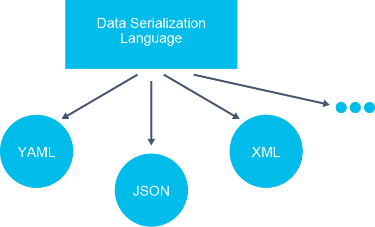
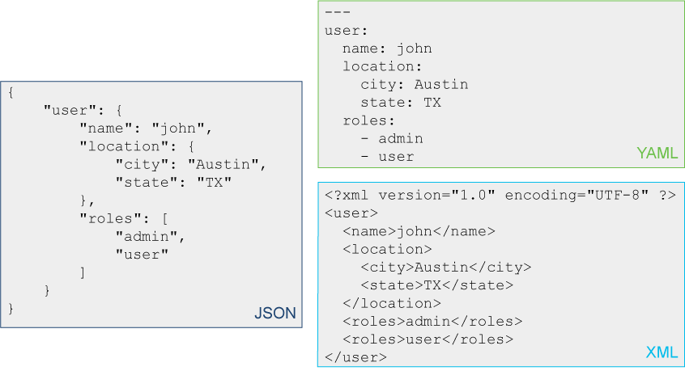
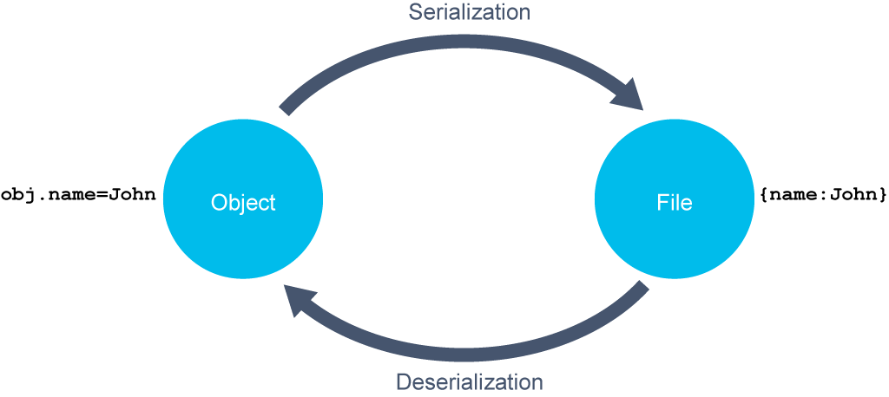

# Data Encoding Formats
Applications communicate with a wide range of APIs using various data encoding formats. Each data encoding format represents syntax coding data that another machine can read, but in a way that is easy to understand for humans.

For instance, if you want to use an API to configure a Cisco router, you must check which data type that API supports. Then, you can start writing a request to be handled by that API that sends an API request to update the router's configuration. An API server comprehends your written code and translates it into instructions suitable for your router to process and create an action.

You will most likely encounter these common data formats:

- YAML Ain't Markup Language (YAML)
- JavaScript Object Notation (JSON)
- eXtensible Markup Language (XML)

# Common Use Cases
Take a look at some of the most common use cases of XML, JSON, and YAML. You will notice that their files have the same extension as their name (.xml for XML, .json for JSON and .yaml for YAML). 

XML is not as humanly readable as the other two formats. XML is verbose, redundant, and complex to use. It is mostly used to interexchange highly structured data between applications (machine-to-machine communication). XML is widely used in Java programming.

JSON serves as an alternative to XML because it is often smaller and easier to read. It is mostly used for transmitting data between a server and a web page. The JSON syntax is the same as the JavaScript programming language; therefore, you can easily convert JSON data into JavaScript objects. JSON syntax is also useful for YAML because JSON is a subset of YAML. Parsing JSON files with a YAML parser is therefore intuitive.

If you are a non-developer building your first API, YAML is a good choice when choosing which data format to use. YAML is made for people who are starting to write code from scratch. XML and JSON are mostly for your programming code to be more machine-readable; you export YAML into one of these two formats. YAML is used in many configuration files today. Because of its similar indentation styles and use of whitespaces for structure, YAML files resonate with people that know Python.

  
# Common Characteristics
Data formats are the foundation of API. They define the syntax and semantics, including the constraints of working with the API.

The syntax is a way to represent a specific data format in textual form. Some formats use curly braces or square brackets, and others have tags marking the beginning and end of an element. In some formats, quotation marks or commas are heavily used, while others do not require them. But no matter which syntax is used, each of these data formats has a concept of an object. You can think of an object as a packet of information, an element with characteristics. An object can have one or more attributes attached to it.

Many characteristics will be broken down to the key-value concept, the key and value often being separated by a colon. The key identifies a set of data, and it is often positioned on the left side of the colon. The values are the actual data that you are trying to represent. Usually, the data appears on the right side of the colon.

To extract the meaning of the syntax, it is crucial that you recognize how keys and values are notated when looking at the data format. A key must be a string, while a value could be a string, a number, or a Boolean (for instance, true or false). Other values could be more complicated, containing an array or an entirely new object representing a lot of its own data.

Another thing to notice when looking at a particular data format is the importance of whitespaces and case sensitivity. Sometimes, whitespaces and case sensitivity could be of high importance, and in others, it could carry no significance whatsoever, as you will get to know through some future examples.

One of the main points about data formats that you should remember is that you can represent any kind of data in any given format.

The figure shows the three previously mentioned common data formats—YAML, JSON, and XML. These examples provide details about a specific user, providing their name, role, and location.

You can quickly recognize that the same data is represented in all three formats, so it comes down to two factors when considering which format to choose:

- If the system you are working with prefers one format over the other, pick the language's format.

- If the system can support any of them, pick the format you are more comfortable working with.

 

In this course, you will be introduced to three of the most common data encoding formats, which are JSON, XML, and YAML:

- **JSON**: JSON is a heavily used data format. JSON was derived from the JavaScript programming language. Because of that historical background, JavaScript code can easily convert data from a JSON file into native JavaScript objects. JSON also shares some similar characteristics with Python dictionaries, and you will learn some of the ways JSON is used with Python. 

- **XML**: XML is another data serialization format broadly used for interchanging information over the Internet within two machines. The beginnings of XML go back to the previous century, with the first version initially defined in 1998. It is very similar to HTML; they are both markup languages, meaning that they indicate which parts of a document are present and not how the data is going to be shown in your system specifically.

- **YAML**: A popular format you will learn about is YAML. According to yaml.org, YAML is a recursive acronym for YAML Ain't Markup Language, which, as the name suggests, is not a markup language like XML. It is more heavily weighted to be humanly writable and readable with a minimalistic format.  However, YAML works the same way as other data formats. Overall, YAML is the most humanly readable of all the formats and, at the same time, is just as easy for programs to use, which is why it is gaining increasing popularity among engineers working with programmability.

---

# Serialization and Deserialization of Data
One important concept you should understand when dealing with data encoding formats is serialization and deserialization. Serialization and deserialization may sound like unfamiliar terms at first, but you perform these two actions in your daily life. Take, for instance, a telephone call between two entities. When talking to another person over the phone, your words have to transform into a series of bits that are then sent over an electronic medium or a wireless signal. Your speech must transform into something understandable to the medium it is traversing. This process is called serialization. On the other side of that telephone call, a receiver has to do the opposite process to extract the meaning from those bits sent over and reconstruct your words. This process is called deserialization.

Serialization in computer science indicates converting a data structure or an object into a binary or textual format that can be stored and reconstructed later. You want to save an object constructed in your code to a file, giving it permanent storage. This way, you preserve the state of an object. Serialized files could be in YAML, JSON, XML, or any other textual data format or a binary format. 

The serialized file could now be transferred to any other system over the network. The receiving system can open that file and reconstruct it to the original state with all the objects defined inside. This process is the opposite of serialization, and it is called deserialization.

Like saving data to files, APIs also require reliable serialization and deserialization to exchange data. Most programming languages, like Python, have existing tools for working with various data formats.

Here is a practical example that you could be facing as a network engineer working with network programmability. You have written some code in Python for configuring switches in your organization. You want to send the data held in your objects to the switch API in a format that it will understand unmistakably. You have to convert that Python data structure into a valid YAML, JSON, or XML format. To do that, you will use the serialization process. 

Other times, you might want to get information about your switch's specific interface through that same API. You would receive a configuration of that switch from the API in YAML, JSON, or XML format. To interpret that file so your Python code could understand it, you would use the deserialization process. You extract the details from a textual file and convert them into valid Python objects. This process is also called data or file parsing.